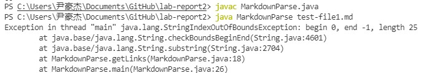

## Fix bugs
> start with original MarkdownParse.java

---

* ### **bug-fix-1**

    - The test file that caused bug like [this](https://heihaheihahello.github.io/lab-report2/test-file1.md):

    ```
    # Title

    what ever text
    ```

    > In this test file, there is no links.
    - **Symptom**: The problematic output is: 
    
    > MarkdownParse.java got "StringIndexOutOfBoundsException" when we .

    - Then we make the following change:
    

    - the fixed output: 

    
    > if there is no links, the output should be a single `[]` with nothing inside. Now the output is what we expected, we fixed this bug.

    - Analysis: Before we fixed, if there is no We add a breaking point after we look for the first `[`, if there is no `[` existed in the file, the index will be -1 and then immediately break the loop. Then nothing is added in `toReturn` as there is no links in the file. So we will only output `[]`. 
    
      

