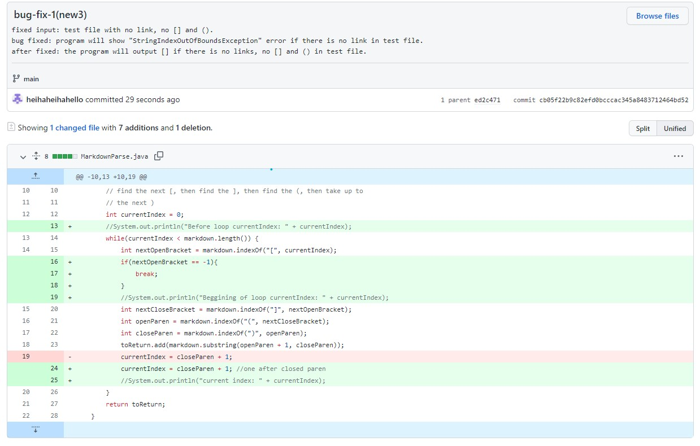

## Fix bugs
> start with original MarkdownParse.java

---

* ### **bug-fix-1**

    1. This [test file](https://heihaheihahello.github.io/lab-report2/test-file1.md) caused bug has no links:

    ```
    # Title

    what ever text
    ```

    2. **Symptom**: The problematic output is: 
    
    > MarkdownParse.java got "StringIndexOutOfBoundsException" error related to the line with `substring` method.

    3. Then we make the following change:
    
    > the fixed markdown of group is [this one](https://github.com/heihaheihahello/markdown-parse/commit/cb05f22b9c82efd0bcccac345a8483712464bd52#diff-c703a0ec03474d601c6bf846740b293e0538bccf38d5f677a302457479e9c652)

    4. the fixed output: 

    

    > if there is no links, the output should be a single `[]` with nothing inside. Now the output is what we expected, we fixed the bug for this test file.

    5. Analysis: Before we fixed, if there is no `[]` and `()`, the index of all `[]()` will be `-1`. Then the `substring(0,-1)` will have error becuase from index `0` to `-1` is not existed. After We add a breaking point after we look for the first `[`, if there is no `[` existed in the file, the index will be `-1` and then immediately break the loop. Then nothing is added in `toReturn` then the error on `substring` will be happened. So we will only output `[]`. 

---

* ### **bug-fix-2**
    

    1. The test file that caused bug is [this](https://heihaheihahello.github.io/lab-report2/test-file2.md):

    ```
    # Title

    what ever text

    we will use `[]` for writing links(it must be).
    [another link!](some-page.html)

    ```
    > In this test file, there is a [] and () but they are not markdown of links

    2. **Symptom**: The problematic output is:
    
    > `it must be` is not a link but is also outputed.
      
    3. Then we make the following change:
    
    > the fixed markdown of group is [this one](https://github.com/heihaheihahello/lab-report2/commit/b18f0e5a3144cf7e7c77be995c9af0cdf1eb8c52#diff-c703a0ec03474d601c6bf846740b293e0538bccf38d5f677a302457479e9c652)

    4. the fixed output: 

    
    > now we only output the links without normal text in `()`.

    5. Analysis: Before we fix, the program will find next `()` after locating a `[]` without considering how many text between `]` and `(`. Only the form of `[](link)` is counted as link. In other words, only when we find the next index of `]` is `(`, we take the content inside `()` as links. The fix is to add this check, if `(` is not immediately behind `]`, we don't add the content in `()` to `toReturn` and `continue` to look for next `[` and `]`.
---

